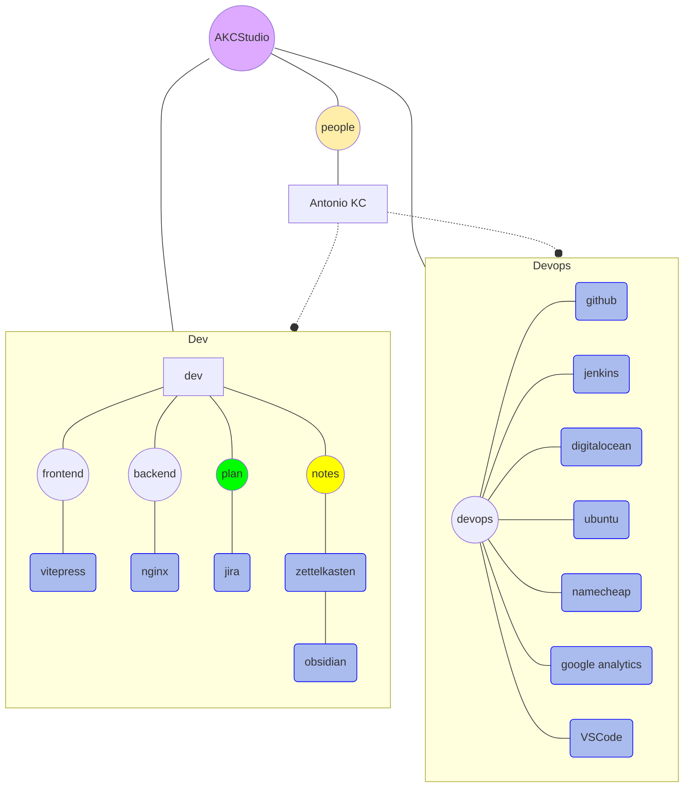

# Acerca de este sitio

## Gente

<VPTeamMembers size="small" :members="members" />

- **Antonio Kobashikawa Carrasco (Rulo)**
  - Desarrollo web: Frontend, Backend, Devops.
  - AKC Studio es como mi digital garden.

## Qué se usa

### Plan

- [Jira](https://www.atlassian.com/software/jira)
  - Ayuda en el seguimiento de proyectos.

### Notas

- [Zettelkasten](https://zettelkasten.de/posts/overview/)
  - Método para producir, organizar y procesar notas personales.
- [Obsidian](https://obsidian.md/)
  - Administración de notas personales.

### Frontend

- [VitePress](https://vitepress.dev/)
  - Framework de documentación, basado en Vue.

### Backend

- [NGINX](https://www.nginx.com/)
  - Web server.

### Devops

- [GitHub](https://github.com/)
  - Hosting de repositorios git. Aloja a [vitepress-akcstudio](https://github.com/akobashikawa/vitepress-akcstudio)
- [Jenkins](https://www.jenkins.io/)
  - Servidor de automatizaciones para despliegues automáticos.
- [DigitalOcean](https://m.do.co/c/87053dad838b)
  - 
  - Hosting de VPS.
- [Ubuntu Linux](https://ubuntu.com/blog/tag/22-04-lts)
  - Sistema operativo corriendo en el VPS.
- [Namecheap](https://www.namecheap.com/)
  - Servicio de venta de dominios.
- [Google Analytics](https://analytics.google.com/)
  - Servicio de analítica web.
- [Visual Studio Code](https://code.visualstudio.com/)
  - IDE para desarrollar html, css, js, java, etc

## Cómo se hace AKC Studio

- Aplico ideas de Zettelkasten.
  - Cada día, voy ingresando notas a mi journal.
  - Proceso las notas en obsidian.
  - Con el tiempo, aparece contenido que voy publicando en [Proyectos](projects/)
- Organizo las tareas con Jira.

[Cambios recientes](changes)

