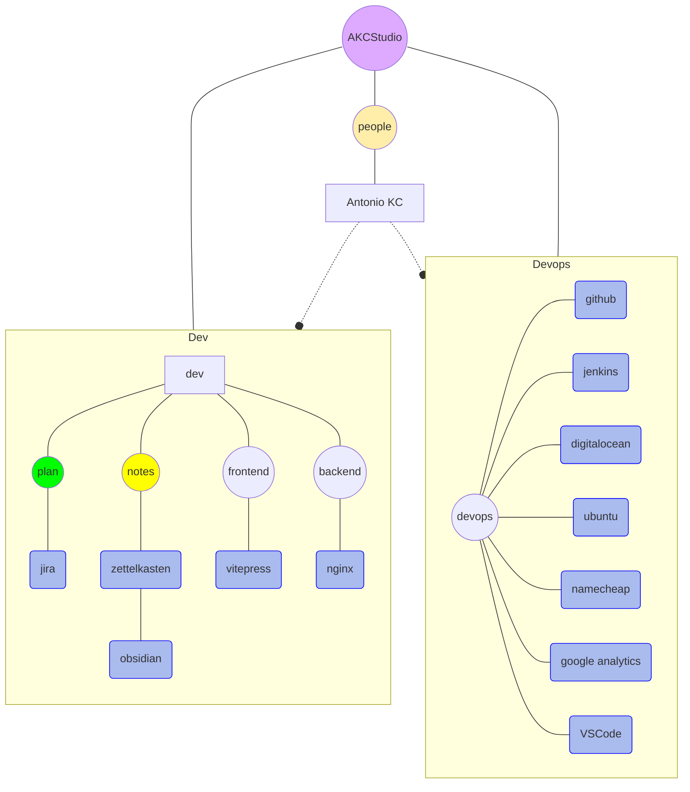

# About this site

## People

<VPTeamMembers size="small" :members="members" />

- **Antonio Kobashikawa Carrasco (Rulo)**
  - Web development. Frontend, Backend, Devops.
  - AKC Studio is like my digital garden.

## What it uses

### Planning

- [Jira](https://www.atlassian.com/software/jira)
  - Help on project management.

### Notes

- [Zettelkasten](https://zettelkasten.de/posts/overview/)
  - Method to produce, organize and process personal knowledge.
- [Obsidian](https://obsidian.md/)
  - Personal knowledge manager.

### Frontend

- [VitePress](https://vitepress.dev/)
  - Framework for documentation, based on Vue.

### Backend

- [NGINX](https://www.nginx.com/)
  - Web server.

### Devops

- [GitHub](https://github.com/)
  - Hosting for git repositories like [vitepress-akcstudio](https://github.com/akobashikawa/vitepress-akcstudio)
- [Jenkins](https://www.jenkins.io/)
  - Automation server for deploy.
- [DigitalOcean](https://www.digitalocean.com/)
  - 
  - Hosting of VPS.
- [Ubuntu Linux](https://ubuntu.com/blog/tag/22-04-lts)
  - Operating System running on VPS.
- [Namecheap](https://www.namecheap.com/)
  - Domain name seller.
- [Google Analytics](https://analytics.google.com/)
  - Analytics service by Google.
- [Visual Studio Code](https://code.visualstudio.com/)
  - IDE to develop html, css, js, java, etc.

## How I do AKC Studio

- I apply ideas from Zettelkasten.
  - Every day, I enter notes into my journal.
  - I process the notes in obsidian.
  - Over time, content appears that I publish in [Projects](projects/) 
  - I organize tasks with Jira. 

[Recent changes](/changes)

