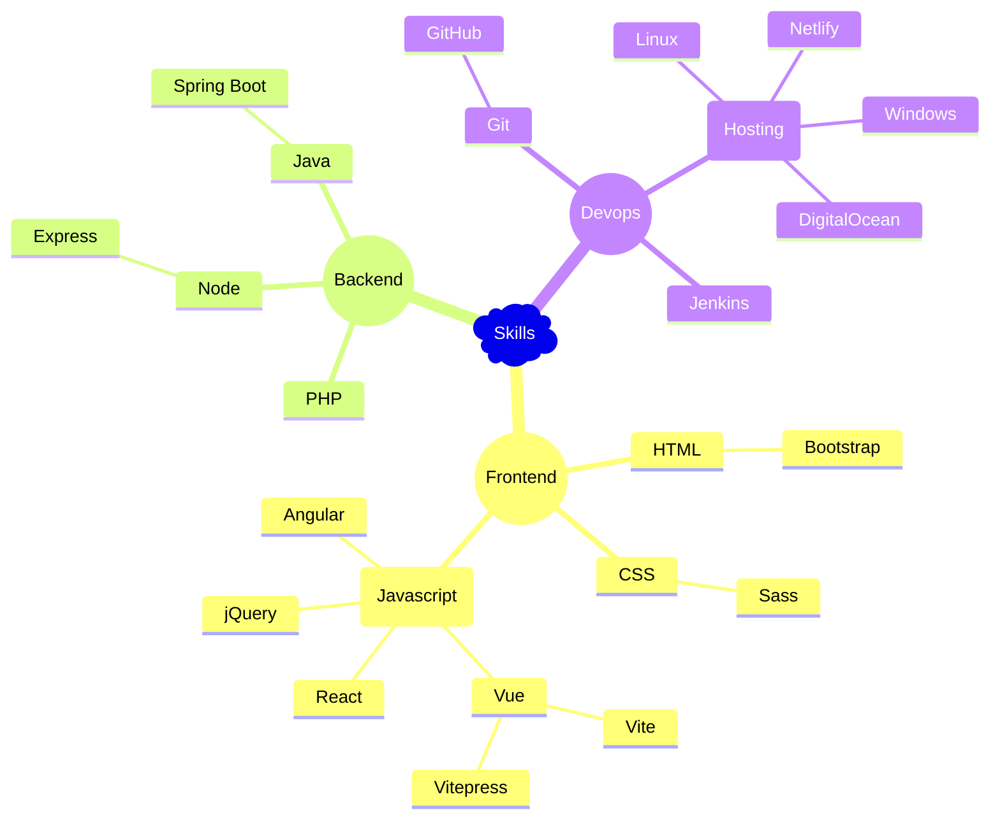
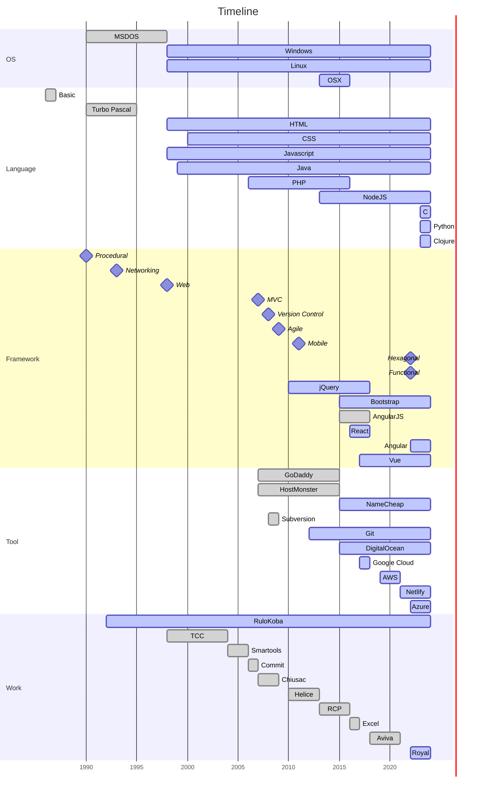

---
# https://vitepress.dev/reference/default-theme-home-page
layout: home

hero:
  name: "AKC Studio"
  text: explore | thinking | playing | solving | dev | learning
  tagline: I'm Antonio Kobashikawa and I do web development.
  image:
    src: /img/webdev-logo.png
  actions:
    # - theme: brand
    #   text: Markdown Examples
    #   link: /markdown-examples
    # - theme: alt
    #   text: API Examples
    #   link: /api-examples
    - theme: brand
      text: What I learned today
      link: https://akc-bitacora.netlify.app/notas/
    - theme: brand
      text: Reading
      link: /reading/
    - theme: alt
      text: "@netlify"
      link: https://antoniokc.netlify.app/
    - theme: alt
      text: "@medium"
      link: https://medium.com/@rulokoba
    - theme: alt
      text: "@twitter"
      link: https://twitter.com/rulokoba
    - theme: alt
      text: "@linkedin"
      link: https://www.linkedin.com/in/akobashikawa/
    - theme: alt
      text: "@slideshare"
      link: https://www.slideshare.net/akobashikawa/

features:
  - title: <a href="frontend">Frontend</a>
    details: <strong>User Interface.</strong> HTML, CSS, Javascript, Bootstrap, Vue, React, Angular
  - title: <a href="backend">Backend</a>
    details: <strong>Business Logic.</strong> Node.js, Express.js, PHP, Java, Spring Boot
  - title: <a href="devops">Devops</a>
    details: <strong>Solutions Deployment.</strong> Git, Github, Jenkins, Linux, Windows
---

 
 

 
 

