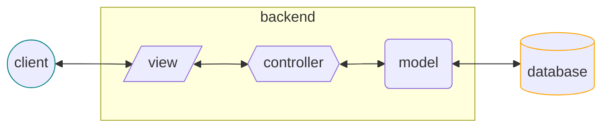
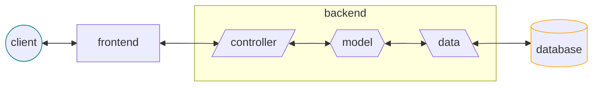

# Backend

It is the part of **web development** focused on the **interface for the frontend**:

- the data required by the client (_REST API_)
- the logic of processes (_business logic_)
- the data required by the logic (_database_)

Just as the frontend is attentive to the **user experience** with the interface it develops for the user, it is reasonable for the backend to be attentive to the **frontend experience** with the interface it develops for the frontend.

## MVC

## Frontend - Backend

