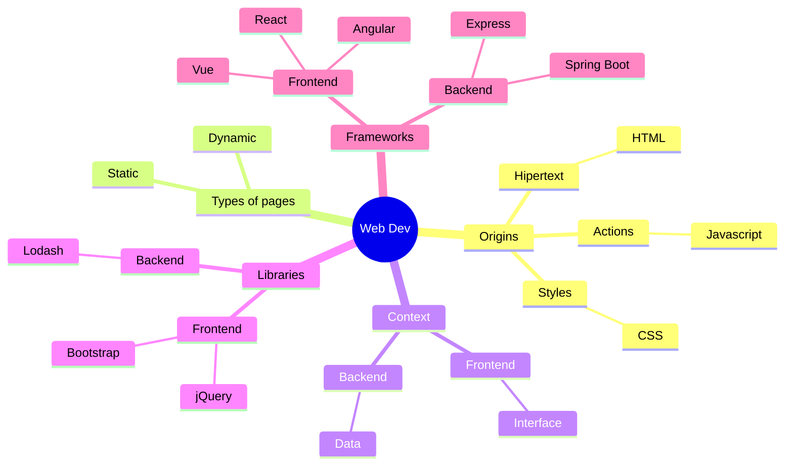
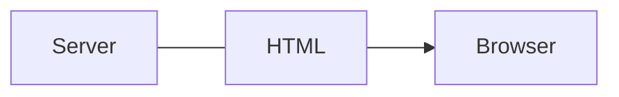

# Concepts on Web Development

**web** development is focused on creating _web_ pages, _web_ sites and _web_ applications.

On the Internet, the universe of interconnected web pages is known as **the web**.

[Brief History of the Web](web-history)

## Pages, sites, applications

First, it was *creating* **web pages** (_web pages_), hypertext documents, where one can jump from page to page.

Then, it was *grouping* the pages into **web sites** (_web sites_), to have a set of related pages. For example, a magazine website.

Next, it was *programming* **web applications** (_web apps_), which are web pages organized as an application. For example, an online store.

## Servers

Web pages are primarily made with _HTML_ code and stored on web servers.

A web server is a computer dedicated to serving web pages to browsers upon request.

Each page has an address. When we open it, the web server sends the HTML, which is opened by a browser and thus we see the page.

To do all this, the browser and servers use the _HTTP_ protocol.

::: info

Each web server has an **IP address**, which allows it to be located. For example, 67.207.84.142

It also usually has a **domain**, which can be used instead of the IP. For example, akcstudio.com

Each page and each web resource has a **URL**, which is the address that allows it to be located on the web. For example, https://dev.akcstudio.com/webdev.html

:::

::: info

The programming that can be done with HTML is not _imperative_, as when programming with C or Java, but _declarative_, which uses tags to tell the computer what to do.

:::

::: info

**Hosting** is what the service of hosting web content is called.

:::

::: tip

In cheap hosting, you share a machine with other users.

A **VPS** (Virtual Private Server) is a server that is not shared with other users and one has more power to install and manage.

:::

## Static and dynamic

The simplest way to serve a web page is to send an HTML text file to be opened in the browser as is. These types of pages are called **static**.

A more sophisticated way to serve a web page is to make a program that constructs new HTML each time it is needed. This is known as a **dynamic** page.

Among the most popular languages for making dynamic pages have been: [Perl](https://www.perl.org/), [Java](https://www.java.com/es/), [PHP]( https://www.php.net/), [Python](https://www.python.org/) and [Javascript/Node.js](https://nodejs.org/) .

::: info

To handle the complexity of development, libraries and frameworks are often used.

A **library** is a set of utilities that solve certain issues and we can take advantage of them to avoid having to solve everything.

A **framework** proposes a way of organizing the code, or even a way of considering the development process, so that it is more understandable and maintainable.

:::

## Web 2.0

At the beginning, web users were simply readers.

When web applications allowed users to alter what was published and become authors, the name Web 2.0 was given to that state.

For example, **Wikis** (community catalog), **blogs** (personal diaries), and **CMS** (content managers), are types of applications that allow you to upload your own content.

Also social networks, such as **Facebook**, **Youtube**, **Instagram**, and **TikTok**, facilitate the publication of multimedia content.

## AJAX

Normally, when the browser requests something from the server and receives a response, this response means loading a new page or reloading the existing page.

[AJAX](https://www.w3schools.com/xml/ajax_intro.asp) is a technique that uses javascript so that the browser can receive responses from the server without having to refresh the entire page.

This allows you to make applications that feel more like a desktop application.

## Frontend and Backend

With AJAX, it is no longer necessary to rebuild the page every time it is responded to, only the data that produces a change.

So, it was considered convenient to organize the development so that the user interface part was done on one hand (the **frontend**) and the handling and sending of data on the other hand (the **backend**). .

Thus, frontend frameworks such as [Meteor](https://www.meteor.com/), [Angular](https://angular.io/), [React](https://react.dev/) and [Vue](https://vuejs.org/), which allow you to build applications with very sophisticated interfaces.

##Agile

- In the **academic environment** (such as tutorials), a workflow of **tasks** that are **determined** and **well known** is used.
- In the **real world**, there are usually **problems**, indeterminate issues, with **unknown** parts.
	- The need to **change**, add or remove, objectives or features, during the course of development, is also frequent.
- [Agile]([What is Agile? | Agile 101 | Agile Alliance](https://www.agilealliance.org/agile101/)) is about **managing uncertainty** and delivering the best that can be produced, with the materials available, in the time available.

::: tip
### Processes on products

Although the reason is software, focusing on software is usually not the best strategy.

To repeat, more important than the software is the process of making the software.
:::

::: tip
### When developing:

- Avoid expensive solutions if there is a cheaper one available.
- For example, it is usually expensive and unnecessary to validate an idea with a complete infrastructure running.
- Makes each change expensive and painful.
- Creates resistance to change.
- It is better to divide development into stages that allow for more economical partial validations.
- It is better to use **descriptions** for ideas that have not yet been validated.
- It is best to use **sketches** to describe components that have not yet been validated.
- It is better to use **mockups** to provide data that has not yet been validated.
- That one solution does not obstruct the following solutions.
- It is better to implement something approximate and that will run than to look for something perfect that will not be implemented.
:::

::: info
### Contextos

- The following states can be considered:
	- Idea
	- Sketch
	- Mockup
	- Programming
	- Production
- Each state determines a **context**, or **set of considerations**.
- To move to the next state a **validation** is needed in the current state.
	- The idea must be validated before proceeding to make the sketch
	- The sketch must be validated before proceeding to make the mockup
	- The model must be validated before proceeding to programming
	- The programming must be validated before going to production
- Evaluation criteria are determined by the state
	- For example, it is not useful to use production criteria in the context of an idea.
	- In the context of an idea, the idea of the solution is validated.
	- In the context of a sketch, it is validated if something goes or doesn't go in a certain approximate area.
	- In the context of a model, the arrangement of the components is validated.
	- In the context of programming, it is validated whether the components behave as expected.
	- In the production context, it is validated if the solution works as expected.
- These states apply both to the application in general and to each feature that you want to implement.
- It is normal that cycles have to be repeated totally or partially while discoveries are made and the solution takes shape.
:::

::: tip
### Progressive development

- Some relevant part of the solution is chosen
- The idea is validated
- The sketch is validated
- The mockup is validated
	- Frontend
		- Hardcoded data is displayed
- The API is validated
	- Frontend
		- Data from endpoints is displayed
	- Backend
		- Controllers: Provides endpoint with hardcoded data
- Business logic is validated
	- Backend
		- Controllers: Provides endpoint with service data
		- Services: Implement business logic with hardcoded data
- Data is validated
	- Backend
		- Controllers: Provides endpoint with service data
		- Services: Implement business logic with data from the repository
		- Repositories: Hardcoded data
- Connectivity with database is validated
	- Backend
		- Controllers: Provides endpoint with service data
		- Services: Implement business logic with data from the repository
		- Repositories: Database
- This scheme is followed for each feature and for the application in general.

:::
