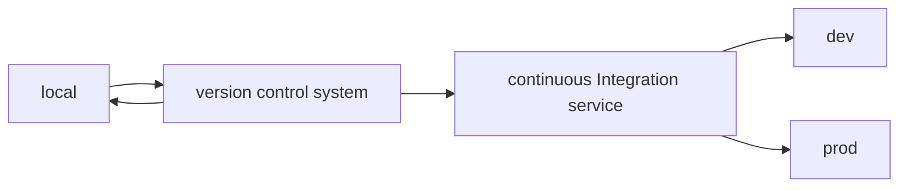

# Devops

It is the part of web development focused on the **deployment** of the application:

- where you can run the application **when it is developed**
- where you can run the application **in production**
- how the application is **updated** progressively across these environments

