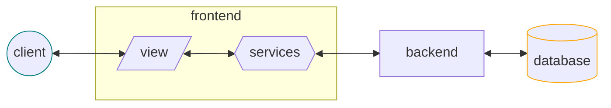

# Frontend

It is the part of **web development** focused on the **user interface** (_UI_):

- what you see (_HTML_, _CSS_)
- component interactions (_JS_)
- user experience (_UX_)

```mermaid
flowchart LR

style client stroke:teal
style database stroke:orange

client((client)) <--> view
subgraph frontend
    direction LR
    view[/view/] <--> services{{services}}
end
services <--> backend[backend] <--> database[(database)]

```