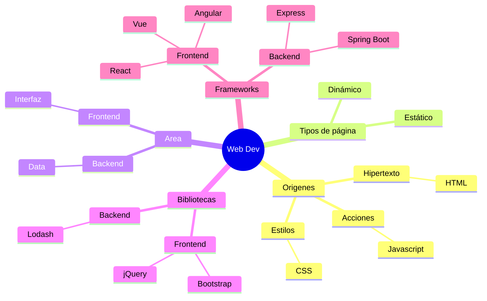
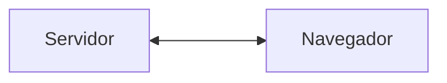

# Desarrollo Web

El desarrollo web está enfocado en páginas web, sitios web y aplicaciones web.

**La web** es, básicamente, la parte de internet construida en torno a contenido _HTML_.

[Breve Historia de la Web](web-historia)

## Páginas, sitios, aplicaciones

Primero se trató de *hacer* **páginas web** (_web pages_), que son documentos de hipertexto, donde uno puede saltar de página en página.

Luego, se trató de *agrupar* las páginas en **sitios web** (_web sites_), para tener un conjunto de páginas relacionadas. Por ejemplo, el sitio web de una revista.

Después, se trató de *programar* **aplicaciones web** (_web apps_), que son páginas web organizadas como una aplicación. Por ejemplo, una tienda online.

## Servers

El código HTML para mostrar una página web es enviado a los navegadores desde computadoras llamadas **servidores web**.

El navegador interpreta el HTML para mostrarnos la página web.

El navegador y los servidores se comunican usando el protocolo _HTTP_.

::: info

Cada servidor web tiene una **dirección ip**, que es un conjunto de números que permite localizarlo. Por ejemplo, 67.207.84.142

También puede tener un **dominio**, que es un nombre que se puede usar en lugar del ip. Por ejemplo, akcstudio.com

Cada página y cada recurso web tiene un **URL**, que es la dirección que permite localizarla en la web. Por ejemplo, https://akcstudio.com/webdev.html

:::

::: info

HTML no es un lenguaje de programación _imperativo_, como C o Java, pero es un lenguaje de programación _declarativo_, que usa etiquetas para indicar lo que hay que hacer. 

:::

::: info

**Hosting** es como se llama al servicio de alojar contenido web.

El hosting de un servidor windows suele ser más caro por el pago de las licencias involucradas.

En comparación, el hosting de un servidor linux es mucho más económico.

Los servicios de hosting más populares y económicos suelen ser los que corren en un servidor linux con soporte para PHP.

:::

::: tip

Un **VPS** (Virtual Private Server) es un servidor que no se comparte con otros usuarios. No se trata de una máquina física, que sería más cara, sino virtual.

En un VPS, se tiene el poder de instalar lo que se desee. PHP, Java, Node, etc, además de herramientas y aplicaciones que normalmente no están disponibles en un hosting compartido. También suele haber opciones para manejar dominios y subdominios, entre otras cosas.

:::

## Estático y dinámico

La forma más simple de hacer una página web es un archivo de texto HTML y enviarlo al navegador tal cuál. Ese tipo de página se llaman **estática**.

Una forma más sofisticada de servir una página web es hacer un programa que construya nuevo HTML cada vez que se necesita. Eso se conoce como página  **dinámica**.

Entre los lenguajes más populares para hacer páginas dinámicas han figurado: [Perl](https://www.perl.org/), [Java](https://www.java.com/es/), [PHP](https://www.php.net/), [Python](https://www.python.org/) y [Javascript/Node.js](https://nodejs.org/) .

::: info

Cuando se desarrolla aplicaciones complejas, es fácil enredarse. Fueron apareciendo propuestas de programadores con experiencia para tratar con esta complejidad.

Una **biblioteca** (o librería) es un conjunto de utilidades que resuelven ciertas cuestiones y podemos aprovechar para no tener que resolverlo todo.

Un **framework** plantea una forma de organizar el código, o incluso una forma de plantear el proceso de desarrollo, para que sea más comprensible y mantenible.

:::

## Web 2.0

Al inicio, los usuarios de la web simplemente eran lectores.

Cuando las aplicaciones web permitieron que los usuarios pudieran alterar lo publicado y convertirse en autores, se dio a ese estado el nombre Web 2.0.

Por ejemplo, los **Wikis** (catálogo comunitario), **blogs** (diarios personales), y **CMS** (administradores de contenido), son tipos de aplicaciones que permiten subir contenido propio.

También redes sociales, como **Facebook**, **Youtube**, **Instagram**, y **TikTok**, facilitan la publicación de contenido multimedia.

## AJAX

Normalmente, cuando el navegador pide algo al server y recibe una respuesta, esta respuesta significar cargar una nueva página o recargar la página existente.

[AJAX](https://www.w3schools.com/xml/ajax_intro.asp) es una técnica que usa javascript para que el navegador pueda recibir respuestas del server sin tener que actualizar toda la página.

Esto permite hacer aplicaciones que se sienten más como una aplicación de escritorio.

## Frontend y Backend

Con AJAX, ya no es necesario reconstruir la página cada vez que se responde, sino solo los datos que produzcan algún cambio.

Entonces, se vio conveniente organizar el desarrollo de modo que la parte de la interfaz de usuario se haga por un lado (el **frontend**) y la del manejo y envío de datos por otro lado (el **backend**).

Así, aparecieron frameworks frontend como [Meteor](https://www.meteor.com/), [Angular](https://angular.io/), [React](https://react.dev/) y [Vue](https://vuejs.org/), que permiten construir aplicaciones con interfaces muy sofisticadas.

## Agile

- En el **ambiente académico** (como el de los tutoriales), se usa un flujo de trabajo propio de **tareas** que son **determinadas** y **bien conocidas**.
- En el **mundo real**, lo usual es que haya **problemas**, cuestiones indeterminadas, con partes **desconocidas**.
	  - También es frecuente la necesidad de **cambiar**, agregar o quitar, objetivos o características, en el transcurso del desarrollo.
- [Agile]([What is Agile? | Agile 101 | Agile Alliance](https://www.agilealliance.org/agile101/)) trata de **manejar la incertidumbre** y entregar lo mejor que se pueda producir, con los materiales disponibles, en el tiempo disponible.

::: tip
### Procesos sobre productos

Aunque el motivo es el software, centrarse en el software no suele ser la mejor estrategia.

Para repetirlo, más importante que el software es el proceso para realizar el software.

:::

::: tip
### Al desarrollar:

- Evitar las soluciones caras si hay alguna más económica disponible.
	- Por ejemplo, suele ser costoso e innecesario validar una idea con una infraestructura completa corriendo.
		- Hace costoso y doloroso cada cambio.
			- Crea resistencia al cambio.
	- Es mejor dividir el desarrollo en etapas que permitan validaciones parciales más económicas.
	- Es mejor usar **descripciones** para ideas que aún no han sido validadas.
	- Es mejor usar **bocetos** para describir componentes que aún no han sido validados.
	- Es mejor usar **mockups** para proveer data que aún no ha sido validada.
- Que una solución no obstruya las siguientes soluciones.
- Es mejor implementar algo aproximado y que llegue a correr que buscar algo perfecto que no se logrará implementar.
:::

::: info
### Contextos

- Se puede considerar los siguientes estados:
	- Idea
	- Boceto
	- Maqueta
	- Programación
	- Producción
- Cada estado determina un **contexto**, o **conjunto de consideraciones**.
- Para pasar al siguiente estado se necesita una **validación** en el estado presente.
	- La idea debe ser validada antes de pasar a hacer el boceto
	- El boceto debe ser validado antes de pasar a hacer la maqueta
	- La maqueta debe ser validada antes de pasar a programar
	- La programación debe ser validada antes de pasar a producción
- Los criterios de evaluación son determinados por el estado
	- Por ejemplo, no es útil usar criterios de producción en el contexto de una idea.
	- En el contexto de una idea, se valida la idea de la solución.
	- En el contexto de un boceto, se valida si algo va o no va en cierta area aproximada.
	- En el contexto de una maqueta, se valida la disposición de los componentes.
	- En el contexto de la programación, se valida si los componentes se comportan como se espera.
	- En el contexto de producción, se valida si la solución funciona como se espera.
- Estos estados se aplican tanto para la aplicación en general como para cada feature que se desea implementar.
- Es normal que se tengan que repetir ciclos total o parcialmente mientras se van haciendo descubrimientos y va cobrando forma la solución.
:::

::: tip
### Desarrollo progresivo

- Se elige alguna parte relevante de la solución
- Se valida la idea
- Se valida el boceto
- Se valida la maqueta
	- Frontend
		- Se muestran datos hardcodeados
- Se valida la API
	- Frontend
		- Se muestran datos provenientes de endpoints
	- Backend
		- Controladores: Provee endpoint con datos hardcodeados
- Se valida business logic
	- Backend
		- Controladores: Provee endpoint con datos de servicios
		- Servicios: Implementa business logic con datos hardcodeados
- Se valida datos
	- Backend
		- Controladores: Provee endpoint con datos de servicios
		- Servicios: Implementa business logic con datos del repositorio
		- Repositorios: Datos hardcodeados
- Se valida conectividad con base de datos
	- Backend
		- Controladores: Provee endpoint con datos de servicios
		- Servicios: Implementa business logic con datos del repositorio
		- Repositorios: Base de datos
- Se sigue este esquema para cada feature y para la aplicación en general.

:::

