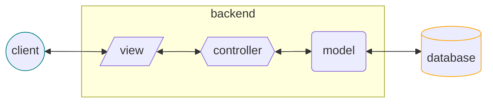
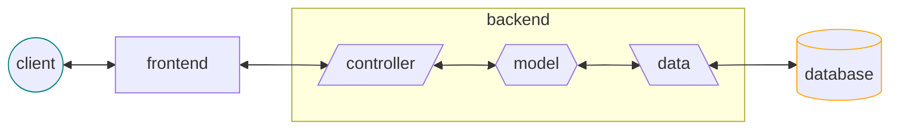

# Backend

Es la parte del **desarrollo web** enfocada en la **interfaz para el frontend**:

- los datos que requiere el cliente (_REST API_)
- la lógica de los procesos (_business logic_)
- los datos que requiere la lógica (_base de datos_)

Así como el frontend está atento a la **experiencia del usuario** con la interfaz que desarrolla para el usuario, es razonable que el backend esté atento a la **experiencia del frontend** con la interfaz que desarrolla para el frontend.

## MVC

## Frontend - Backend

