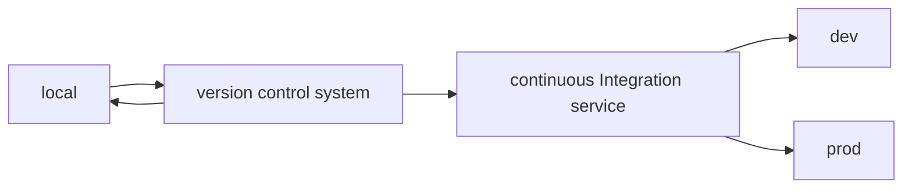

# Devops

Es la parte del desarrollo web enfocada en el **despliegue** de la aplicación:

- dónde puede correr la aplicación **cuando se desarrolla**
- dónde puede correr la aplicación **en producción**
- cómo se **actualiza** la aplicación progresivamente a través de estos ambientes

