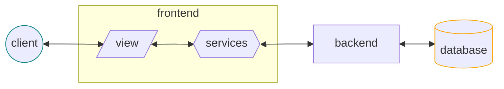

# Frontend

Es la parte del **desarrollo web** enfocada en la **interface del usuario** (_UI_):

- lo que se ve (_HTML_, _CSS_)
- la interacción de los componentes (_JS_)
- la experiencia de uso (_UX_)

